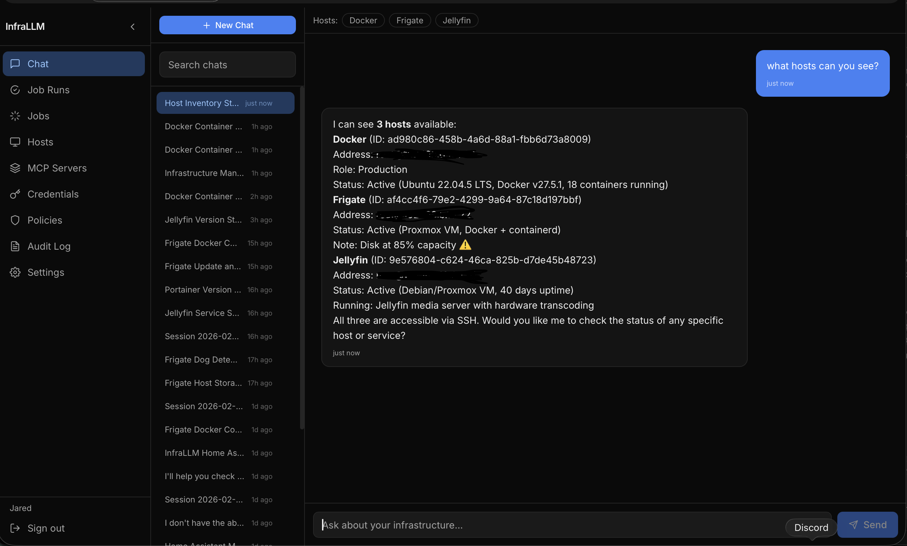
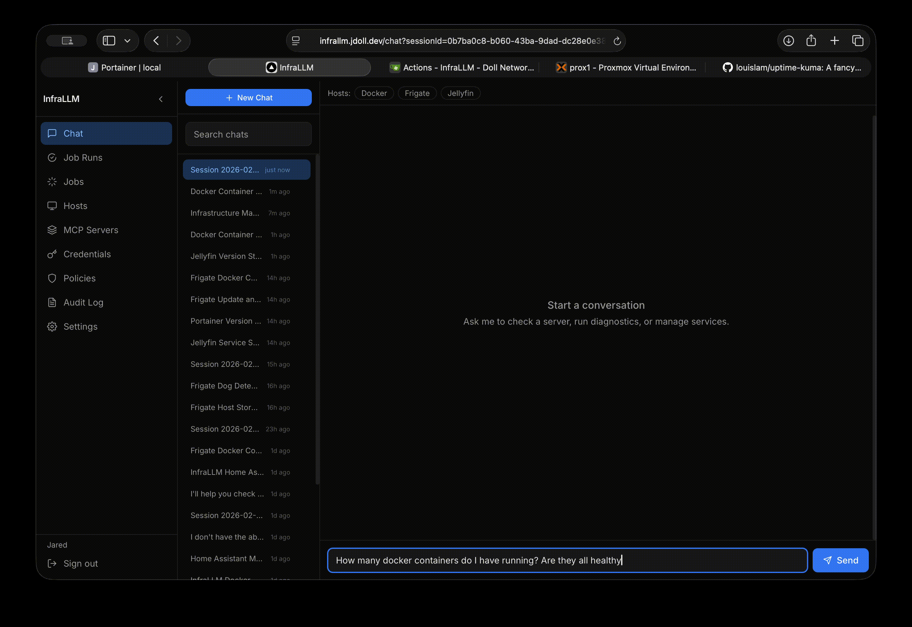
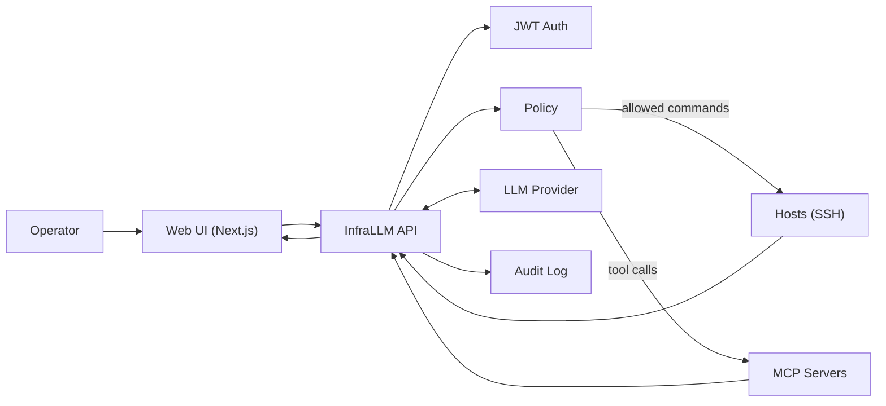

# InfraLLM

> Alpha status: This product is in early development. Use at your own risk.

InfraLLM is an open source infrastructure assistant. Using plain english, sysadmins can troubleshoot issues, add functionality and perform maintenance on their servers. The InfraLLM API layer sits between the servers and the LLM providing tooling, guardrails, and a full audit log. 

It's a chat-first workflow for ops work: policy enforcement, credential encryption, and streaming responses. You get the speed and knowledge of LLMs without surrendering control.

InfraLLM can also run as an MCP server, so MCP-compatible clients (Claude Desktop, Cursor, etc.) can connect to it directly and safely interact with hosts configured in within.

InfraLLM is built for sysadmins and MSPs who need reliable automation: scheduled jobs, webhook-triggered workflows, and repeatable incident response playbooks that can run across fleets with policy enforcement and logging baked in.



---

## Demo




---

## What it does

- **AI Gateway to your infrastructure** - Acts as the control plane between AI and your infrastructure. Limits what commands AI has access to on each host.
- **Natural language SSH** — describe a task, InfraLLM plans and executes solutions.
- **Host management** — add servers via ssh credentials (Encrypted at rest!)
- **Jobs + webhooks** — trigger automated incident workflows from monitoring alerts, ticketing systems, or internal tooling
- **Policy enforcement** — commands are allowed or denied based on configurable regex patterns per user and host
- **Audit logging** — every command and response is logged against the user who triggered it
- **Streaming responses** — chat UI streams responses in real time via SignalR
- **JWT auth** — register/login, tokens stored in browser, backend fully stateless

---

## How it works



---

## Tech stack

| Layer | Tech |
|---|---|
| Backend | ASP.NET Core (.NET 10), SignalR, Entity Framework Core |
| Database | PostgreSQL 16 |
| Frontend | Next.js (standalone build) |
| LLM | Optional: Anthropic, OpenAI, or Ollama |
| Container | Docker, nginx (all-in-one image) |

---

## Environment variables

These are the key variables you'll need to configure. For local dev, everything has hardcoded defaults in `docker-compose.yml`.

LLM access is optional. InfraLLM supports `anthropic`, `openai`, and `ollama` providers.

- Set `LLM_PROVIDER` to one of: `anthropic`, `openai`, `ollama`
- For `anthropic`, set `ANTHROPIC_API_KEY`
- For `openai`, set `OPENAI_API_KEY` (and optional `OPENAI_BASE_URL` for compatible gateways)
- For `ollama`, set `OLLAMA_BASE_URL` (default `http://host.docker.internal:11434` in Docker)

Without a configured provider, built-in chat/jobs are disabled and InfraLLM can still be used via MCP.

| Variable | Description | Example |
|---|---|---|
| `LLM_PROVIDER` | LLM provider (`anthropic`, `openai`, `ollama`) | `openai` |
| `ANTHROPIC_API_KEY` | (Optional) Your Anthropic API key (enables LLM chat) | `sk-ant-...` |
| `OPENAI_API_KEY` | (Optional) Your OpenAI (or compatible) API key | `sk-proj-...` |
| `OPENAI_BASE_URL` | (Optional) OpenAI-compatible API base URL | `https://api.openai.com` |
| `OPENAI_MODEL` | Default OpenAI model | `gpt-4.1` |
| `OLLAMA_BASE_URL` | Ollama API base URL | `http://host.docker.internal:11434` |
| `OLLAMA_MODEL` | Default Ollama model | `llama3.1` |
| `ConnectionStrings__DefaultConnection` | Postgres connection string | `Host=postgres;Port=5432;Database=infrallm;Username=infrallm;Password=secret` |
| `Jwt__Secret` | JWT signing secret (min 32 chars) | `some_long_random_secret_here` |
| `Jwt__Issuer` | JWT issuer | `InfraLLM` |
| `Jwt__Audience` | JWT audience | `InfraLLM` |
| `CredentialEncryption__MasterKey` | Encrypts SSH credentials at rest | `$(openssl rand -base64 32)` |
| `Cors__Origins` | Allowed CORS origins | `http://localhost:3010` |
| `NEXT_PUBLIC_API_URL` | Frontend API base URL | `http://localhost:5010` |
| `Anthropic__MaxTokens` | Max tokens per LLM response | `8192` |

For production, you'll want to generate real secrets for `Jwt__Secret` and `CredentialEncryption__MasterKey` — don't reuse the dev defaults.

---

## Deployment

### All-in-one container (recommended)

The all-in-one image bundles the backend and frontend into a single container behind nginx. This is the simplest way to self-host.

```bash
docker pull ghcr.io/jd174/infrallm:main
```

Ports inside the container:
- `80` — nginx reverse proxy (routes `/api` to backend, everything else to frontend)
- `8080` — backend (internal)
- `3000` — frontend (internal)

A sample production compose file is in `docker-compose.prod.yml`. Use this file to get started quickly. It runs the all-in-one app with Postgres. Make sure to update the JWT key. It need to be at least 32 characters for the app to run.

### Portainer

If you're using Portainer, deploy `docker-compose.prod.yml` directly as a Stack. Set these environment variables in the Portainer UI:

| Variable | Notes |
|---|---|
| `POSTGRES_PASSWORD` | Strong password for the database |
| `JWT_SECRET` | At least 32 random characters |
| `LLM_PROVIDER` | `anthropic`, `openai`, or `ollama` |
| `ANTHROPIC_API_KEY` | (Optional) From console.anthropic.com |
| `OPENAI_API_KEY` | (Optional) From platform.openai.com |
| `OLLAMA_BASE_URL` | (Optional) Ollama endpoint if using local models |
| `CREDENTIAL_MASTER_KEY` | `openssl rand -base64 32` |
| `CORS_ORIGINS` | Your frontend's public URL |

---

## Use InfraLLM as an MCP server (Claude Desktop)

InfraLLM can expose an MCP endpoint over SSE. You can connect to it from Claude Desktop using `mcp-remote`.

1) Create an access token in the InfraLLM UI: **Access Tokens** page.

2) Add an MCP server entry in your Claude Desktop config (replace placeholders):

```json
{
	"mcpServers": {
		"infrallm": {
			"command": "npx",
			"args": [
				"-y",
				"mcp-remote",
				"https://<infrallmUrl>/mcp/sse",
				"--header",
				"Authorization: Bearer <your-infrallm-access-token>"
			]
		}
	}
}
```


### Separate containers

If you'd rather run backend and frontend separately, both have individual Dockerfiles:
- `src/InfraLLM.Api/Dockerfile` — backend only
- `frontend/Dockerfile` — frontend only

You'll need to configure `NEXT_PUBLIC_API_URL` to point the frontend at your backend.

---

## Ports reference

| Service | Host port | Container port |
|---|---|---|
| UI (dev) | `3010` | `3000` |
| API (dev) | `5010` | `8080` |
| All-in-one | `3010` | `80` |
| Postgres | `5432` (dev only) | `5432` |

---

## Authentication

Register an account through the UI on first run. JWTs are issued on login and stored in the browser. There's no magic admin account — just register and go.

If login fails unexpectedly, check that your database migrations ran and that `Jwt__Secret` is at least 32 characters.

---

## Troubleshooting

**Build error: `Resource file "**/*.resx" cannot be found`**
Default embedded resources are disabled in `InfraLLM.Infrastructure.csproj` — this is intentional.

**Chat responses cut off early**
Increase `Anthropic__MaxTokens`. The default is 8192; Claude supports up to 32k+ depending on the model.

**SignalR streaming not working**
Make sure `NEXT_PUBLIC_API_URL` (or `NEXT_PUBLIC_WS_URL` if set separately) points to your backend host and that CORS is configured to allow your frontend origin.

**Migrations not running**
Check the backend container logs on startup. EF Core runs `MigrateAsync()` at startup — if Postgres isn't healthy yet, the app will retry via health check dependencies.

---

## Contributing

PRs and issues welcome. If you're adding a feature, open an issue first so we can talk through the approach.

---

## License

MIT
