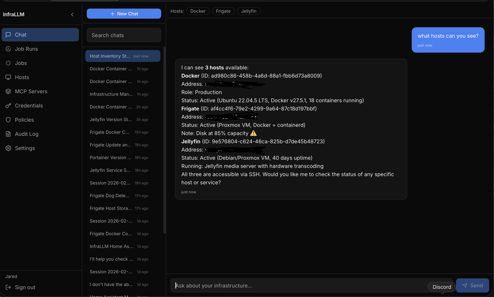
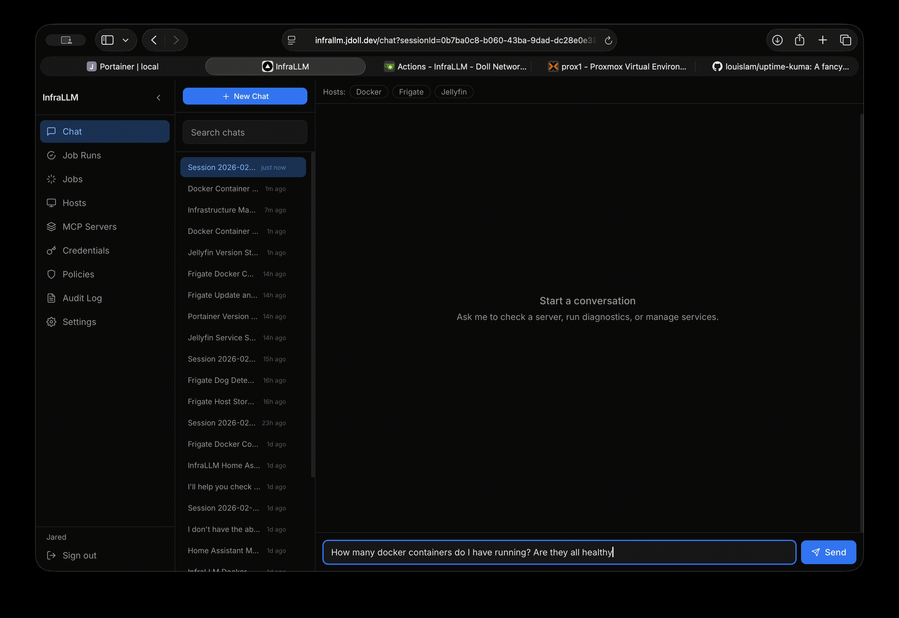
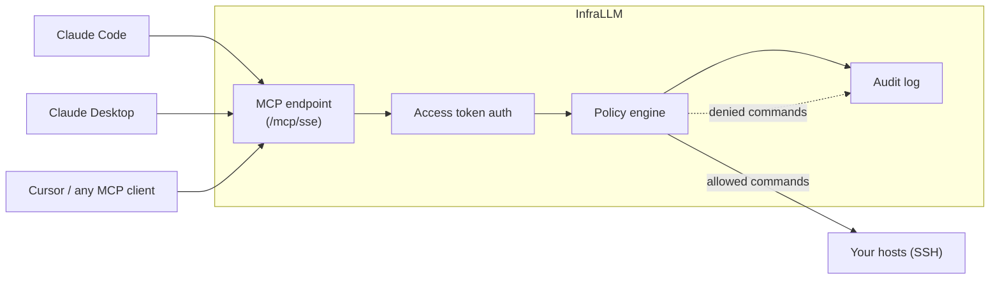

# InfraLLM

> Alpha status: This product is in early development. Use at your own risk.

**InfraLLM is the secure MCP gateway to your infrastructure.** Bring your own AI — Claude Code, Claude Desktop, Cursor, or any MCP-compatible client — and give it safe, policy-controlled access to your servers.

Instead of handing an AI raw SSH keys, you point it at InfraLLM. The gateway holds your credentials (encrypted at rest), enforces per-host command policies, and writes a full audit trail of every tool call. Your AI gets 13 purpose-built infrastructure tools; you keep control of what it can actually do.

InfraLLM is built for sysadmins, homelabbers, and MSPs who want the speed of AI-driven ops without surrendering the keys to their fleet.



---

## Demo



---

## How it works


```mermaid
flowchart LR
	CC["Claude Code"] --> GW
	CD["Claude Desktop"] --> GW
	CU["Cursor / any MCP client"] --> GW
	subgraph InfraLLM
		GW["MCP endpoint<br/>(/mcp/sse)"] --> TOK["Access token auth"]
		TOK --> POLICY["Policy engine"]
		POLICY --> AUDIT["Audit log"]
	end
	POLICY -- "allowed commands" --> HOSTS["Your hosts (SSH)"]
	POLICY -. "denied commands" .-> AUDIT
```

1. Add your hosts and SSH credentials in the InfraLLM web UI (credentials are encrypted at rest).
2. Create an access token and connect your AI client to the MCP endpoint.
3. The AI works through InfraLLM's tools — every command is policy-checked before it runs and audit-logged after.

---

## Connect your AI client

First, create an access token in the web UI (**Access Tokens** page). Then:

### Claude Code

```bash
claude mcp add --transport sse infrallm https://<your-instance>/mcp/sse \
  --header "Authorization: Bearer infra_YOUR_TOKEN"
```

### Claude Desktop

Add to `claude_desktop_config.json`:

```json
{
  "mcpServers": {
    "infrallm": {
      "command": "npx",
      "args": [
        "-y", "mcp-remote", "https://<your-instance>/mcp/sse",
        "--header", "Authorization:Bearer infra_YOUR_TOKEN"
      ]
    }
  }
}
```

### Cursor

Add to `.cursor/mcp.json`:

```json
{
  "mcpServers": {
    "infrallm": {
      "url": "https://<your-instance>/mcp/sse",
      "headers": { "Authorization": "Bearer infra_YOUR_TOKEN" }
    }
  }
}
```

Authentication also works via the `X-API-Key: infra_...` header or an `?api_key=` query parameter. The endpoint supports both the MCP HTTP+SSE transport (`GET /mcp/sse`) and stateless JSON-RPC (`POST /mcp/messages`).

---

## MCP tools

| Tool | What it does |
|---|---|
| `list_hosts` | List managed hosts, optionally filtered by environment |
| `get_host_details` | Host details including operational notes |
| `execute_command` | Run a shell command over SSH — policy-checked, with `dry_run` support |
| `test_host_connection` | Test SSH connectivity with diagnostics |
| `tail_logs` | Tail log files or the systemd journal |
| `read_file` | Read a file from a host |
| `write_file` | Write a file with automatic timestamped backup |
| `check_service_status` | `systemctl status` for a service |
| `list_containers` | List Docker containers with status and ports |
| `check_container_status` | Container state plus recent logs |
| `update_host_notes` | Record findings and runbooks against a host |
| `list_policies` | Show configured command policies |
| `get_audit_logs` | Query the audit trail |

---

## What you get as the operator

- **Policy enforcement** — allow/deny command patterns per host, evaluated before anything executes
- **Encrypted credentials** — SSH keys and passwords encrypted at rest with a master key; the AI never sees them
- **Audit logging** — every tool call, command, and denial logged against the token that made it
- **Access tokens** — scoped, revocable, optionally expiring credentials for each client
- **Host notes** — a shared operational memory the AI reads and updates across sessions
- **Jobs + webhooks** — trigger automated workflows from monitoring alerts or ticketing systems
- **Optional built-in assistant** — a bundled chat UI (Anthropic, OpenAI, or Ollama) if you don't want to bring your own client

---

## Optional: the built-in assistant

InfraLLM ships with a chat UI that uses the same tools, policies, and audit log as external MCP clients. It's entirely optional — without a configured LLM provider, chat and jobs are hidden and InfraLLM runs as a pure MCP gateway.

To enable it, set `LLM_PROVIDER` to one of `anthropic`, `openai`, or `ollama`:

- For `anthropic`, set `ANTHROPIC_API_KEY`
- For `openai`, set `OPENAI_API_KEY` (and optional `OPENAI_BASE_URL` for compatible gateways)
- For `ollama`, set `OLLAMA_BASE_URL` (default `http://host.docker.internal:11434` in Docker)

---

## Tech stack

| Layer | Tech |
|---|---|
| Backend | ASP.NET Core (.NET 10), SignalR, Entity Framework Core |
| Database | PostgreSQL 16 |
| Frontend | Next.js (standalone build) |
| LLM (optional) | Anthropic, OpenAI, or Ollama |
| Container | Docker, nginx (all-in-one image) |

---

## Environment variables

These are the key variables you'll need to configure. For local dev, everything has hardcoded defaults in `docker-compose.yml`. No LLM provider is required to run InfraLLM as an MCP gateway.

| Variable | Description | Example |
|---|---|---|
| `ConnectionStrings__DefaultConnection` | Postgres connection string | `Host=postgres;Port=5432;Database=infrallm;Username=infrallm;Password=secret` |
| `Jwt__Secret` | JWT signing secret (min 32 chars) | `some_long_random_secret_here` |
| `Jwt__Issuer` | JWT issuer | `InfraLLM` |
| `Jwt__Audience` | JWT audience | `InfraLLM` |
| `CredentialEncryption__MasterKey` | Encrypts SSH credentials at rest | `$(openssl rand -base64 32)` |
| `Cors__Origins` | Allowed CORS origins | `http://localhost:3010` |
| `NEXT_PUBLIC_API_URL` | Frontend API base URL | `http://localhost:5010` |
| `LLM_PROVIDER` | (Optional) LLM provider for built-in chat (`anthropic`, `openai`, `ollama`) | `openai` |
| `ANTHROPIC_API_KEY` | (Optional) Anthropic API key | `sk-ant-...` |
| `OPENAI_API_KEY` | (Optional) OpenAI (or compatible) API key | `sk-proj-...` |
| `OPENAI_BASE_URL` | (Optional) OpenAI-compatible API base URL | `https://api.openai.com` |
| `OPENAI_MODEL` | Default OpenAI model | `gpt-4.1` |
| `OLLAMA_BASE_URL` | Ollama API base URL | `http://host.docker.internal:11434` |
| `OLLAMA_MODEL` | Default Ollama model | `llama3.1` |
| `Anthropic__MaxTokens` | Max tokens per LLM response | `8192` |

For production, you'll want to generate real secrets for `Jwt__Secret` and `CredentialEncryption__MasterKey` — don't reuse the dev defaults.

---

## Deployment

### All-in-one container (recommended)

The all-in-one image bundles the backend and frontend into a single container behind nginx. This is the simplest way to self-host.

```bash
docker pull ghcr.io/jd174/infrallm:main
```

Ports inside the container:
- `80` — nginx reverse proxy (routes `/api` and `/mcp` to backend, everything else to frontend)
- `8080` — backend (internal)
- `3000` — frontend (internal)

A sample production compose file is in `docker-compose.prod.yml`. Use this file to get started quickly. It runs the all-in-one app with Postgres. Make sure to update the JWT key. It needs to be at least 32 characters for the app to run.

### Portainer

If you're using Portainer, deploy `docker-compose.prod.yml` directly as a Stack. Set these environment variables in the Portainer UI:

| Variable | Notes |
|---|---|
| `POSTGRES_PASSWORD` | Strong password for the database |
| `JWT_SECRET` | At least 32 random characters |
| `CREDENTIAL_MASTER_KEY` | `openssl rand -base64 32` |
| `CORS_ORIGINS` | Your frontend's public URL |
| `LLM_PROVIDER` | (Optional) `anthropic`, `openai`, or `ollama` for built-in chat |
| `ANTHROPIC_API_KEY` | (Optional) From console.anthropic.com |
| `OPENAI_API_KEY` | (Optional) From platform.openai.com |
| `OLLAMA_BASE_URL` | (Optional) Ollama endpoint if using local models |

### Separate containers

If you'd rather run backend and frontend separately, both have individual Dockerfiles:
- `src/InfraLLM.Api/Dockerfile` — backend only
- `frontend/Dockerfile` — frontend only

You'll need to configure `NEXT_PUBLIC_API_URL` to point the frontend at your backend. If you're connecting MCP clients, make sure `/mcp` routes to the backend.

---

## Ports reference

| Service | Host port | Container port |
|---|---|---|
| UI (dev) | `3010` | `3000` |
| API (dev) | `5010` | `8080` |
| All-in-one | `3010` | `80` |
| Postgres | `5432` (dev only) | `5432` |

---

## Authentication

Register an account through the UI on first run. JWTs are issued on login and stored in the browser. There's no magic admin account — just register and go.

MCP clients and API integrations authenticate with long-lived access tokens (`infra_...`) created on the **Access Tokens** page. Tokens are scoped to your organization, revocable, and can be given an expiry.

If login fails unexpectedly, check that your database migrations ran and that `Jwt__Secret` is at least 32 characters.

---

## Troubleshooting

**MCP client can't connect**
Check that `/mcp` is routed to the backend (the all-in-one nginx config does this), and that the access token is active — revoked and expired tokens are rejected. The endpoint is `GET /mcp/sse` for the SSE transport and `POST /mcp/messages` for stateless JSON-RPC.

**Build error: `Resource file "**/*.resx" cannot be found`**
Default embedded resources are disabled in `InfraLLM.Infrastructure.csproj` — this is intentional.

**Chat responses cut off early**
Increase `Anthropic__MaxTokens`. The default is 8192; Claude supports up to 32k+ depending on the model.

**SignalR streaming not working**
Make sure `NEXT_PUBLIC_API_URL` (or `NEXT_PUBLIC_WS_URL` if set separately) points to your backend host and that CORS is configured to allow your frontend origin.

**Migrations not running**
Check the backend container logs on startup. EF Core runs `MigrateAsync()` at startup — if Postgres isn't healthy yet, the app will retry via health check dependencies.

---

## Contributing

PRs and issues welcome. If you're adding a feature, open an issue first so we can talk through the approach.

---

## License

MIT
